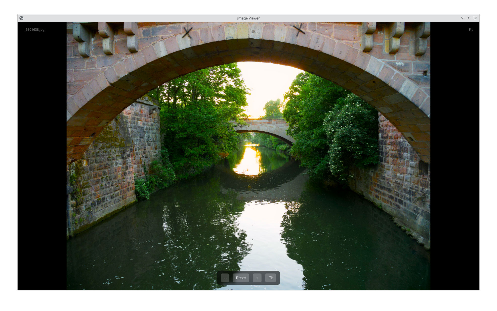

With the help of this Python script, you can use the web browser Chromium as an image viewer that has implemented the Wayland Color Management Protocol.

## Requirements:

- Chromium browser version 141 or higher
- Python 3
- Wayland session with color management enabled
- p3 or wide gamut monitor with correct icc-profile

## Usage:

Just download/copy the file, make it exacutable, and open an photo/image with it, e.g. ./chrompy-viewer.py /path/to/your/pic.jpg. Of course, you can also set up your graphical file manager (Dolphin etc) to open photos with this script.
